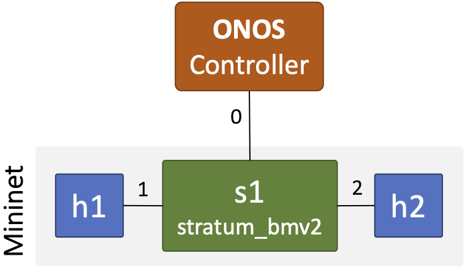

# Assignment 0: Virtual Networks using Mininet, Stratum, and ONOS

In this assignment, you will learn how to set up a virtual environment, consisting of a network of hosts and switches, using open-source and production-ready tools (like [Mininet](http://mininet.org/) and [ONOS](https://opennetworking.org/onos/)). 

> **Note:** It's important that you finish this assignment successfully, as you will be using the virtual environment in later assignments!

## Part A: Install Docker

[Docker](https://www.docker.com/) is an open-source platform that lets us develop and deploy applications as a collection of fine-grain, OS-agnostic components called containers. These containers allow independently running components of the application to execute in any environment (e.g., Linux, Windows, or Mac) while sharing a single host kernel's resources. It's different from Virtual Machines (VMs), where each VM runs its own kernel while sharing a single hardware server. 

Visit [https://docs.docker.com/get-docker/](https://docs.docker.com/get-docker/) to download and install the correct version for your operating system. After that, run the post installation steps listed here: [https://docs.docker.com/engine/install/linux-postinstall/](https://docs.docker.com/engine/install/linux-postinstall/).

The nice thing about Docker is that you won't have to spend time installing the various tools and codebases we will use during the programming assignments. Installing these can, at times, become really tedious and time-consuming. Docker offloads all of that grunt work and lets you start using these tools from the get-go (as you will see in a bit)!

## Part B: Setup a Virtual Network

In the following steps, we will learn how to set up a virtual network using Mininet, Stratum, and ONOS.

- **Mininet:** It is a tool that emulates a complete network of hosts, links, and switches on a single machine, [http://mininet.org/](http://mininet.org/). We will be using a docker version of this tool from [Open Networking Lab](https://hub.docker.com/r/opennetworking/mn-stratum) that adds a custom switch `stratum_bmv2`, running Stratum---a new switch operating system.

> **Note:** For these assignments, you won't be interacting directly with Stratum; rather, you will send marching instructions to switches from the ONOS controller (see next).

- **ONOS:** Open Network Operating System (ONOS &reg;) is a recent open-source SDN controller for managing and controlling large software-defined networks (SDN), [https://opennetworking.org/onos/](https://opennetworking.org/onos/). We will learn how to write applications for ONOS and deploy them in our virtual environment. We will also use the ONOS REST API to allow standard python-based applications to interact with the controller and install rules to switches.

In this assignment, we will build a network as depicted in the following figure.



### a. Clone this repository to your host machine (laptop, desktop, or AWS EC2)

The first step is to clone this repository on your machine. Change into the desired folder and clone the repository using `git`.

```sh
$ cd <path-to-folder>
$ git clone https://gitlab.com/purdue-cs536/fall-2022/public.git
```

> **Notes:**
> - You can also clone the repository using a `git` docker, in case you don't have it installed locally.
> ```sh 
> docker run -it --rm -v ${PWD}:/git -w /git alpine/git clone https://gitlab.com/purdue-cs536/fall-2022/public.git
> ```
> - The docker scripts for Mininet (with Stratum) and ONOS, including other helper code, are located under the `assignments/scripts` folder. Please go through them to gain some insight into how to use Docker.

### b. Start the ONOS and Mininet dockers

We have provided a `Makefile` containing the commands needed to run Mininet, ONOS, and other configurations. Open four separate command shells and `cd` into the `assignment0` folder.

* In the first shell, **start ONOS**:

```sh
$ cd public/assignments/assignment0
$ make controller
```

This will start the ONOS controller. You will see a lot of information printed on the terminal; wait until it stops -- and it will stop!

> **Note:** As Docker is running these containers for the first time, it will need to download them from https://hub.docker.com. These are large images (hundreds of megabytes), so they may take some time to download depending upon the network speed -- don't worry if the process is slow. It will happen only once, as Docker will cache these images and reuse them whenever the dockers are started again.

* In the second terminal, **start Mininet**:

```sh
$ cd public/assignments/assignment0
$ make mininet
```

Once started, you will see the `mininet>` prompt. This indicates that your virtual network is ready and running, and you can now issue commands through this prompt.

Let's try listing the hosts and switches in this network and their connectivity. Enter ...

```sh
mininet> net
```

Output:
```
mininet> net
h1 h1-eth0:s1-eth1
h2 h2-eth0:s1-eth2
s1 lo:  s1-eth1:h1-eth0 s1-eth2:h2-eth0
```

This shows three nodes in this network: `h1`, `h2`, and `s1`. For `h1` and `h2`, their `eth0` interface is connected to switch `s1` `eth1` and `eth2` interfaces, respecitvely.

> **Note:** Visit [http://mininet.org/walkthrough/](http://mininet.org/walkthrough/) to learn more about Mininet and the various commands you can run inside it.

If you try pinging the two hosts (`h1` and `h2`) in Mininet, you will see that the pings won't follow through. From the second terminal, for Mininet, run ...

```sh
mininet> h1 ping -c 4 h2
```

It's because the switch `s1`, at the moment, doesn't know how to route the incoming packets. For that, we will have to connect switch `s1` to the ONOS controller and run a network application (`fwd`) in ONOS that will instruct the switch where to route these packets.

* In the third terminal, **start ONOS CLI**:

To activate the network application `fwd`, start the ONOS command-line interface (CLI) from the third terminal.

```sh
$ cd public/assignments/assignment0
$ make cli 
```

It will prompt a password, which is `rocks` ... and ONOS clearly ROCKS!

Once started, you will see the `onos@root >` prompt. To activate `fwd`, run ...

```sh
onos@root > app activate fwd
```

Output:
``` sh
onos@root > app activate fwd
Activated org.onosproject.fwd
```

> **Note:** Visit [https://wiki.onosproject.org/display/ONOS/The+ONOS+CLI](https://wiki.onosproject.org/display/ONOS/The+ONOS+CLI) to learn various commands that ONOS CLI currently supports. You will find them handy when working on your assignments.

* In the fourth terminal, **run ONOS netcfg** script:

Now, let the ONOS controller know of switch `s1` by passing it the `public/assignments/assignment0/cfg/netcfg.json` file using the `onos-netcfg` script. The JSON file tells the controller through which ip:port to connect to `s1`.

From the fourth terminal, run ...

```sh
$ cd public/assignments/assignment0
$ make netcfg
```

You will see some updates printed on the first terminal, where ONOS is running. Ignore `ERROR`; it's a bug (or typo) in ONOS.

### c. Test `ping`

Head back to the second terminal, running Mininet, and rerun ping...

```sh
mininet> h1 ping h2
```

Output:

```sh
mininet> h1 ping -c 4 h2
PING 10.0.0.2 (10.0.0.2) 56(84) bytes of data.
64 bytes from 10.0.0.2: icmp_seq=1 ttl=64 time=33.7 ms
64 bytes from 10.0.0.2: icmp_seq=2 ttl=64 time=3.03 ms
64 bytes from 10.0.0.2: icmp_seq=3 ttl=64 time=2.95 ms
64 bytes from 10.0.0.2: icmp_seq=4 ttl=64 time=3.05 ms
64 bytes from 10.0.0.2: icmp_seq=5 ttl=64 time=3.27 ms
```

You will see that pings are flowing through now. 

> **Note**: If you notice closely, the first ping took a lot more time (33.7 ms) than the ones sent after. It's because when the switch receives the packet for the first time, it queries the controller to fetch a flow rule to decide where to send the packet.

**You can also test ping by logging into the virtual hosts, `h1` and `h2`.**

From another temrinal, run ... 

```sh
$ cd public/assignments/assignment0
$ make host-h1
```

You will see a prompt, `root@docker-desktop:/workdir#`, indicating that you are now inside the virtual host `h1`. By default, Mininet assigns host IP prefixes starting from `10.0.0.1`. You can verify this by running `ifconfig` inside `h1`. 

To ping `h2`, run ...

```sh 
root@docker-desktop:/workdir# ping 10.0.0.2
```

Output:
```sh
root@docker-desktop:/workdir# ping 10.0.0.2
PING 10.0.0.2 (10.0.0.2) 56(84) bytes of data.
64 bytes from 10.0.0.2: icmp_seq=1 ttl=64 time=24.3 ms
64 bytes from 10.0.0.2: icmp_seq=2 ttl=64 time=1.24 ms
64 bytes from 10.0.0.2: icmp_seq=3 ttl=64 time=1.86 ms
64 bytes from 10.0.0.2: icmp_seq=4 ttl=64 time=1.84 ms
```

> **Note:** You can quit a virtual host by typing `exit`. 

#### Yay, you have successfully finished setting up your first and very own virtual network!

